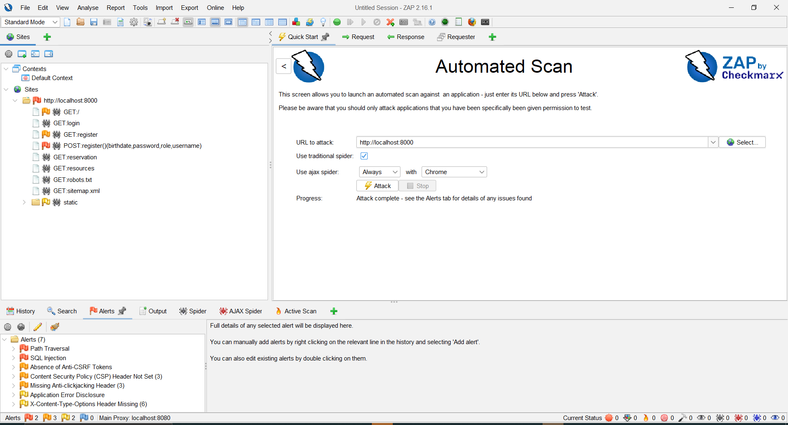

# 1️⃣ Introduction

**Tester(s):**
- Abara Callistus

**Purpose:**
- Identify functional and security vulnerabilities in the *Registration Page* of the Booking System (Phase 1).
- Evaluate handling of invalid inputs, weak passwords, malformed emails, and common attack payloads.

**Scope:**
- **Tested components:**
  - `/register` page
  - Email field
  - Password field
  - Birthdate field
  - Role dropdown
  - Client- & server-side validation
- **Excluded:**
  - Login functionality
  - Resource creation
  - Reservation system
  - Admin functionality
- **Test approach:**
  - Black-box testing

**Test environment & dates:**
- **Start:** 27/11/2025  
- **End:** 27/11/2025  
- **Environment details:**
  - OS: Windows 10
  - Deployment: Docker Desktop
  - Browser: Google Chrome
  - DB: PostgreSQL (Docker container)
  - Base URL: http://localhost:8000
  - Register URL: http://localhost:8000/register

**Assumptions & constraints:**
- No admin/test credentials provided
- Only local environment tested
- Phase 1 limited scope

---

# 2️⃣ Executive Summary

Functional testing showed that the registration form accepts invalid emails and weak passwords due to missing server-side validation.  
While no high-risk vulnerabilities were found, these validation gaps introduce **medium-level security risks**.

**Overall risk level:** 🟠 **Medium**

### Top 5 Immediate Actions
1. Add server-side email validation  
2. Enforce password strength rules  
3. Display error messages for invalid registration attempts  
4. Add input sanitization & audit logging  
5. Add CSRF protection on forms  

---

# 3️⃣ Severity Scale & Definitions

| Severity Level | Description | Recommended Action |
|----------------|-------------|--------------------|
| 🔴 **High** | Critical vulnerability that may lead to a system compromise | Fix immediately |
| 🟠 **Medium** | Missing validation or controls that may expose the system | Fix ASAP |
| 🟡 **Low** | Minor issue or UI-related weakness | Fix soon |
| 🔵 **Info** | Not a vulnerability but relevant for hardening | Monitor |

---

# 4️⃣ Findings (Actual Test Results)

| ID | Severity | Finding | Description | Evidence / Proof |
|----|----------|----------|-------------|------------------|
| **F-01** | 🟠 Medium | Invalid email accepted | Email like `test@wrong` accepted → no server-side validation | User redirected to homepage despite invalid email |
| **F-02** | 🟠 Medium | Weak password accepted | Password `123` allowed → password policy missing | Registration succeeded with weak password |
| **F-03** | 🟡 Low | No validation feedback | Invalid form submission shows no error message | No UI alert for invalid email or password |
| **F-04** | 🔵 Info | Basic XSS sanitized | `` did not execute | Page ignored script |
| **F-05** | 🔵 Info | SQL injection harmless | `' OR 1=1--` had no effect | No SQL error or login bypass |

---

# 5️⃣ OWASP ZAP Test Report (Attachment)

**Purpose:**  
Include the automated scan results from OWASP ZAP for the Booking System (Phase 1).

### Steps performed:
1. Opened **OWASP ZAP**
2. Selected **Automated Scan**
3. Target URL:  
   `http://localhost:8000`
4. Ran full scan against the application
5. Exported scan results as **Markdown**
6. Saved file as:  
   `BookingSystem-Phase1/zap_report_round1.md`

---

### Link to report:
➡️ `./zap_report_round1(2025-11-28).md`

---

Here is the Screenshot
